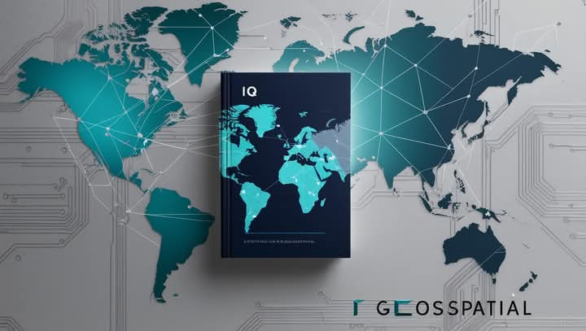

<p align="center">
  
</p>

# IQ GeoSpatial PRO V 2.2.0

Aplicación de escritorio para la certificación de puntos geodésicos de orden C, gestión de imágenes, descarga de efemérides y conversión de documentos Word a PDF.

## By IQ GeoSpatial Technology

## Características principales
- Creación de Estrcutura de expediente IGN-2025

- Creación de formulario:
  - Anexo Formulario 001: Datos Generales
  - Anexo Fromulario 002: Declaracción Jurada
  - Anexo Fromulario 003: Declaración Jurada No Presentar Documentación Fraudalenta
  - Anexo Fromulario 004: Diario de Observaciones
  - Anexo Fromulario 005: Descripción Monográfica

- Descarga de Efemeride:
  - Fuente:
    - ESA, IGS, COD, WHU, GFZ
  - Fuente:
    - Ultra-rapída, Rápida, Final

- Convertir PDF

- Validación de Expediente:
  - ! : Falta
  - ? : No Perteneciente
  - √ : Encontrado

- Connvertir Coordenadas Geográficas a UTM (Viceversa)

- Convertir GNSS a RINEX (Basado en RTKLib)

## Instalación
1. Clona este repositorio o copia los archivos a tu equipo.
2. Instala las dependencias:

```bash
pip install -r requirements.txt
```

3. Ejecuta la aplicación:

```bash
python3 -m main
```

## Empaquetado (opcional)
Para crear un ejecutable con PyInstaller:

```bash
pyinstaller --noconfirm --windowed --icon=Assets\Icono\icono.ico --add-data "Assets;Assets" main.py
```

```bash
python -m PyInstaller --noconfirm --onefile --windowed --icon=Assets\Icono\icono.ico --add-data "Assets;Assets" main.py
```

## Estructura del proyecto
- `main.py`: Lanzador principal de la aplicación.
- `GUI/`: Interfaces gráficas (ventanas, diálogos, widgets).
- `Controllers/`: Lógica de control y conexión entre UI y servicios.
- `Models/`: Modelos de datos y base de datos.
- `Services/`: Servicios de conversión, miniaturas, etc.
- `utils/`: Utilidades y funciones auxiliares.
- `Assets/`: Imágenes, iconos y plantillas.

## Requisitos
- Windows 10/11 (recomendado)
- Python 3.12 o superior

## Créditos
Desarrollado por IQ GeoSpatial

Contacto: iqgeospatial@gmail.com

---
© 2025 IQ GeoSpatial Technology